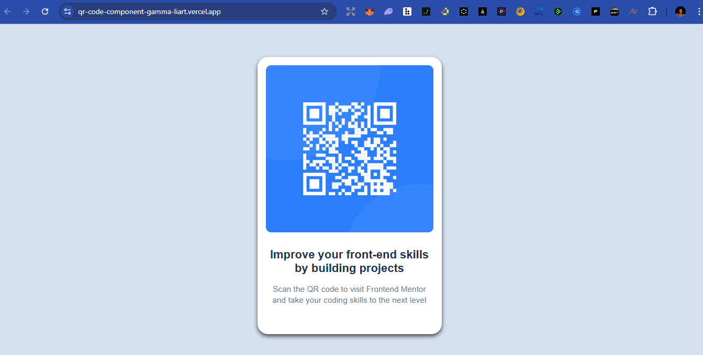

# Frontend Mentor - QR Code Component Solution

This is a solution to the [QR code component challenge on Frontend Mentor](https://www.frontendmentor.io/challenges/qr-code-component-iux_sIO_H).
Frontend Mentor challenges help you improve your coding skills by building realistic projects.

## Table of contents

* [Overview](#overview)

  * [Screenshot](#screenshot)
  * [Links](#links)
* [My process](#my-process)

  * [Built with](#built-with)
  * [What I learned](#what-i-learned)
  * [Continued development](#continued-development)
  * [Useful resources](#useful-resources)
* [Author](#author)
* [Acknowledgments](#acknowledgments)

---

## Overview

### Screenshot




### Links

* Solution URL: (https://tech-goddezz.github.io/QR-Code-Component/)
* Live Site URL: (https://qr-code-component-gamma-liart.vercel.app/)

---

## My process

### Built with

* Semantic **HTML5** markup
* **CSS custom properties**
* **Flexbox** for centering and layout
* **Mobile-first workflow**

---

### What I learned

This project helped me strengthen my understanding of **flexbox alignment, padding vs margin, and card-style layouts**.

For example, I learned how to perfectly center a card on the screen using flex:

```css
body {
  background-color: #D5E1EF;
  min-height: 100vh;
  display: flex;
  justify-content: center;
  align-items: center;
  margin: 0;
}
```

I also practiced applying **border-radius** to both the card and the QR image container:

```css
.qr-component {
  border-radius: 10px;
  overflow: hidden;
}
```

---

### Continued development

In future projects, I want to:

* Improve my **grid layout** skills (for more complex designs).
* Explore **responsive typography** and spacing systems.
* Practice creating **reusable design systems** (colors, spacing, typography).

---

### Useful resources

* [MDN Web Docs - Flexbox](https://developer.mozilla.org/en-US/docs/Learn/CSS/CSS_layout/Flexbox) – Super useful for understanding alignment.
* [Frontend Mentor](https://www.frontendmentor.io) – Great source for real-world projects.

---

## Author

* Frontend Mentor - [@yourusername](https://www.frontendmentor.io/profile/yourusername)
* Twitter - [@yourusername](https://twitter.com/yourusername)

---

## Acknowledgments

Big thanks to **Frontend Mentor** for providing this project and helping me improve step by step.

